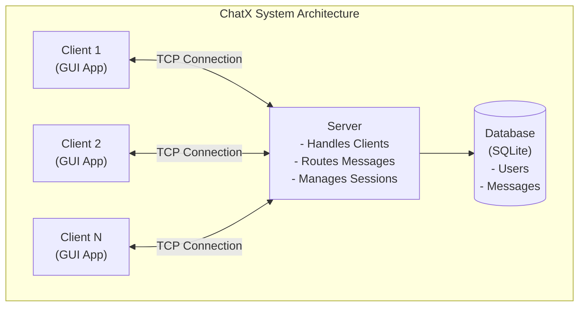
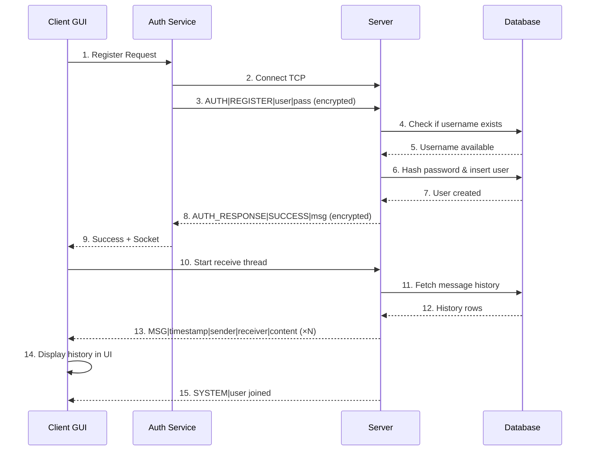
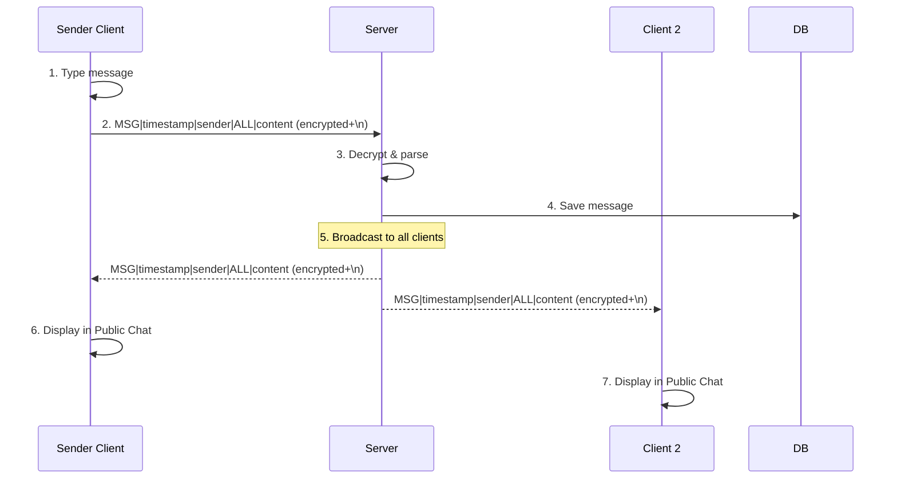
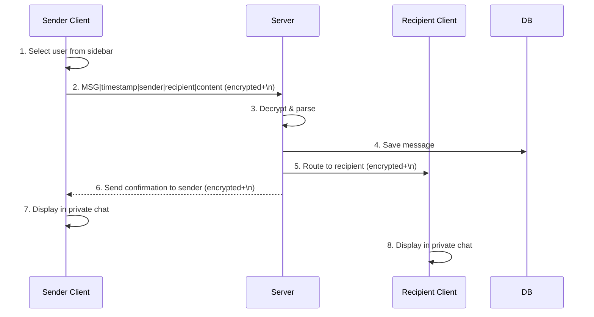
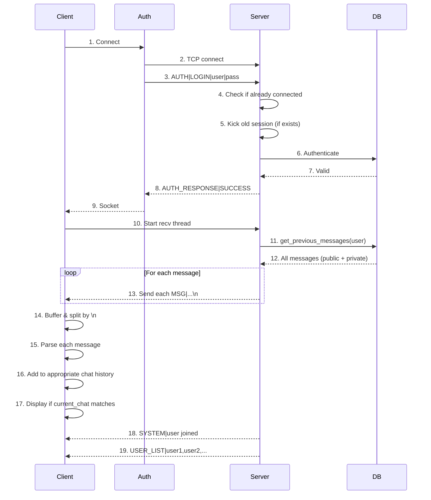

# ChatX - Real-Time Chat Application Documentation

## Table of Contents
1. [System Overview](#system-overview)
2. [Architecture](#architecture)
3. [Use Cases](#use-cases)
4. [Sequence Diagrams](#sequence-diagrams)
5. [Protocol Specification](#protocol-specification)
6. [Database Schema](#database-schema)
7. [Setup & Installation](#setup--installation)
8. [API Reference](#api-reference)

---

## System Overview

ChatX is a secure, real-time chat application built with Python that supports both public and private messaging. The system implements a client-server architecture with end-to-end encryption, persistent message storage, and a modern WhatsApp-like user interface.

### Key Features

- **User Authentication**: Secure login and registration system with password hashing
- **Public Chat**: Group messaging visible to all connected users
- **Private Messaging**: One-on-one encrypted conversations
- **Message History**: Persistent storage and retrieval of chat history
- **Online Presence**: Real-time display of online users
- **Typing Indicators**: Live typing status for enhanced user experience
- **End-to-End Encryption**: All messages encrypted using Fernet (symmetric encryption)
- **Single Session Enforcement**: Prevents multiple concurrent logins
- **WhatsApp-like UI**: Modern, intuitive interface with message bubbles

---

## Architecture

### System Components



### Component Descriptions

#### 1. **Server (`server.py`)**
- Multi-threaded TCP server handling concurrent client connections
- Manages user sessions and authentication
- Routes messages between clients (public and private)
- Broadcasts system notifications and user lists
- Integrates with database for persistence

#### 2. **Client (`client.py`)**
- Tkinter-based GUI application
- Handles user input and displays messages
- Manages separate chat histories for public and private chats
- Implements message buffering for reliable communication
- Auto-discovery of server on local network

#### 3. **Database Manager (`db_manager.py`)**
- SQLite database abstraction layer
- Handles user registration and authentication
- Stores and retrieves message history
- Thread-safe database operations

#### 4. **Authentication Service (`auth_service.py`)**
- Client-side service for server connection
- Manages login/registration handshake
- Handles authentication timeout and errors

#### 5. **Encryption Module (`encryption.py`)**
- Fernet-based symmetric encryption
- Encrypts all network messages
- Uses SHA-256 derived key from shared password

#### 6. **Login Dialog (`login_dialog.py`)**
- Separate Login and Registration UI windows
- Form validation and user-friendly error handling
- Seamless navigation between login and registration

---

## Use Cases

### Use Case 1: User Registration

**Actor**: New User

**Preconditions**: None

**Main Flow**:
1. User launches the client application
2. User clicks "Connect to Server"
3. Server is auto-discovered or user enters server IP
4. Login dialog appears
5. User clicks "Register" link
6. User enters username and password
7. User clicks "Register" button
8. System validates credentials and creates account
9. User is logged in automatically

**Postconditions**: User account created, user connected to chat

**Alternative Flows**:
- 8a: Username already exists → Display error, user re-enters different username
- 8b: Password too short → Display validation error

---

### Use Case 2: User Login

**Actor**: Registered User

**Preconditions**: User account exists

**Main Flow**:
1. User launches the client application
2. User clicks "Connect to Server"
3. Login dialog appears
4. User enters username and password
5. User clicks "Login" button
6. System authenticates credentials
7. If user is already logged in elsewhere, old session is terminated
8. Chat history is fetched from database
9. User is shown Public Chat with history
10. Online users list is populated

**Postconditions**: User logged in, chat history loaded, online status broadcasted

**Alternative Flows**:
- 6a: Invalid credentials → Display error, user retries
- 8a: Database error → User notified, retry login

---

### Use Case 3: Send Public Message

**Actor**: Logged-in User

**Preconditions**: User is authenticated and connected

**Main Flow**:
1. User selects "Public Chat" from sidebar
2. User types message in input field
3. User presses Enter or clicks Send button
4. Message is encrypted and sent to server
5. Server broadcasts message to all connected users
6. All users (including sender) see the message in Public Chat
7. Message is stored in database

**Postconditions**: Message delivered to all users, message persisted

---

### Use Case 4: Send Private Message

**Actor**: Logged-in User

**Preconditions**: User is authenticated, recipient is known (online or has chat history)

**Main Flow**:
1. User selects recipient from sidebar OR clicks username in Public Chat
2. Private chat window opens with chat history
3. User types message in input field
4. User presses Enter or clicks Send button
5. Message is encrypted and sent to server
6. Server routes message only to recipient
7. Both sender and recipient see message in their private chat
8. Message is stored in database

**Postconditions**: Message delivered to recipient, message persisted

**Alternative Flows**:
- 6a: Recipient offline → Message stored in database, delivered when recipient logs in

---

### Use Case 5: View Chat History

**Actor**: Logged-in User

**Preconditions**: User is authenticated

**Main Flow**:
1. User logs in successfully
2. Server retrieves all messages relevant to user:
   - All public messages (receiver = "ALL")
   - Private messages where user is sender or receiver
3. Messages are sent to client
4. Client populates chat histories:
   - Public Chat history
   - Individual private chat histories
5. User can click on Public Chat to see all public messages
6. User can click on a private chat to see that conversation

**Postconditions**: All historical messages displayed correctly

---

### Use Case 6: Start New Chat

**Actor**: Logged-in User

**Preconditions**: User is authenticated, other users are online

**Main Flow**:
1. User clicks "+" button in sidebar
2. "New Chat" window opens showing all online users
3. User selects a user from the list
4. User clicks "Start Chat"
5. Private chat window opens (empty if no history)
6. User added to sidebar under "Direct Messages"
7. User can send message

**Postconditions**: Private chat initiated, user visible in sidebar

---

### Use Case 7: Typing Indicator

**Actor**: Logged-in User

**Preconditions**: User is in a chat (public or private)

**Main Flow**:
1. User starts typing in message input field
2. Client sends "TYPING|ON" message to server
3. Server broadcasts typing status
4. Other users see "Username is typing..." indicator
5. User stops typing (3 seconds timeout)
6. Client sends "TYPING|OFF" message to server
7. Typing indicator disappears for other users

**Postconditions**: Typing status updated

---

## Sequence Diagrams

### 1. User Registration Sequence



### 2. Public Message Flow



### 3. Private Message Flow



### 4. Client Connection & History Loading



---

## Protocol Specification

### Message Format

All messages follow this format:
```
MESSAGE_TYPE|FIELD1|FIELD2|...|FIELDN
```

Each message is:
1. **Encrypted** using Fernet encryption
2. **Encoded** to bytes (UTF-8)
3. **Suffixed** with newline delimiter (`\n`)

### Message Types

#### 1. **Authentication Messages**

**Client → Server: Authentication Request**
```
AUTH|ACTION|USERNAME|PASSWORD
```
- `ACTION`: `LOGIN` or `REGISTER`
- `USERNAME`: String (unique)
- `PASSWORD`: String (plaintext, encrypted in transit)

**Server → Client: Authentication Response**
```
AUTH_RESPONSE|STATUS|MESSAGE
```
- `STATUS`: `SUCCESS` or `FAIL`
- `MESSAGE`: String (success/error message)

---

#### 2. **Chat Messages**

**Client → Server OR Server → Client: Message**
```
MSG|TIMESTAMP|SENDER|RECEIVER|CONTENT
```
- `TIMESTAMP`: Format `YYYY/MM/DD HH:MM:SS`
- `SENDER`: Username
- `RECEIVER`: Username (for private) or `ALL` (for public)
- `CONTENT`: Message text

---

#### 3. **System Messages**

**Server → Client: System Notification**
```
SYSTEM|TIMESTAMP|SERVER|ALL|CONTENT
```
- Used for join/leave notifications
- Example: `SYSTEM|2025/12/25 12:30:45|SERVER|ALL|alice joined the chat`

---

#### 4. **User List**

**Server → Client: Online Users**
```
USER_LIST|USER1,USER2,USER3,...
```
- Comma-separated list of online usernames
- Sent on user join/leave
- Used to populate online users sidebar

---

#### 5. **Typing Indicator**

**Client → Server: Typing Status**
```
TYPING|TIMESTAMP|SENDER|ALL|STATUS
```
- `STATUS`: `ON` or `OFF`
- Server broadcasts to all other users

**Server → Client: Typing Broadcast**
```
TYPING|USERNAME|STATUS
```
- Simplified format for broadcast

---

### Network Protocol

#### Connection Flow
1. Client connects to server via TCP (default port: 5555)
2. Client sends encrypted `AUTH` message
3. Server validates credentials
4. Server sends encrypted `AUTH_RESPONSE`
5. On success:
   - Server adds client to active sessions
   - Server sends message history
   - Server broadcasts join notification
   - Server sends user list
6. Client enters message loop

#### Message Delimiter
- All messages end with `\n` (newline character)
- Both client and server use buffering + splitting by `\n`
- Prevents TCP packet coalescing issues

#### Encryption
- All network messages are encrypted with Fernet (symmetric encryption)
- Key derived from shared password: `network_chat_2024`
- SHA-256 hash converted to base64 URL-safe key

---

## Database Schema

### SQLite Database: `chat_database.db`

#### Table: `users`

| Column         | Type    | Constraints                | Description                 |
|----------------|---------|----------------------------|-----------------------------|
| `id`           | INTEGER | PRIMARY KEY AUTOINCREMENT  | Unique user ID              |
| `username`     | TEXT    | UNIQUE NOT NULL            | Username (login identifier) |
| `password_hash`| TEXT    | NOT NULL                   | SHA-256 hashed password     |
| `created_at`   | TEXT    | NOT NULL                   | Account creation timestamp  |

**Indexes**: Unique index on `username`

---

#### Table: `messages`

| Column      | Type    | Constraints                | Description                     |
|-------------|---------|----------------------------|---------------------------------|
| `id`        | INTEGER | PRIMARY KEY AUTOINCREMENT  | Unique message ID               |
| `sender`    | TEXT    | NOT NULL                   | Username of sender              |
| `receiver`  | TEXT    | NOT NULL                   | Username of receiver or "ALL"   |
| `message`   | TEXT    | NOT NULL                   | Message content                 |
| `timestamp` | TEXT    | NOT NULL                   | Format: YYYY/MM/DD HH:MM:SS     |

**Indexes**: Index on `(sender, receiver)` for efficient history retrieval

**Query Patterns**:
```sql
-- Get all messages for a user (public + sent + received)
SELECT sender, receiver, message, timestamp 
FROM messages 
WHERE receiver = ? OR sender = ? OR receiver = "ALL" 
ORDER BY id;
```

---

## Setup & Installation

### Prerequisites
- Python 3.8+
- pip (Python package manager)

### Installation Steps

1. **Clone/Download the project**
```bash
cd chat_project
```

2. **Install dependencies**
```bash
pip install -r requirements.txt
```

**Required packages**:
- `cryptography` (Fernet encryption)
- `netifaces` (Network interface detection)

3. **Run the Server**
```bash
python server.py
```
- Default host: `0.0.0.0` (all interfaces)
- Default port: `5555`
- Press Enter at prompts to use defaults

4. **Run the Client**
```bash
python client.py
```
- Server auto-discovery on local network
- Or manually enter server IP

5. **First Time Setup**
- Click "Connect to Server"
- Click "Register" to create an account
- Enter username and password
- Start chatting!

---

## API Reference

### Server API (`server.py`)

#### Class: `ChatServer`

**Constructor**:
```python
ChatServer(host='0.0.0.0', port=5555)
```

**Methods**:

```python
def start(self)
```
- Starts the server and begins accepting connections
- Runs in main thread (blocking)

```python
def stop(self)
```
- Gracefully shuts down the server
- Disconnects all clients

```python
def broadcast_message(self, message, sender_username=None)
```
- Broadcasts a message to all connected clients
- `message`: Pre-formatted message string
- `sender_username`: Optional (for filtering)

```python
def send_private_message(self, message, receiver_username)
```
- Sends message to a specific user
- Returns `True` if user online, `False` otherwise

```python
def broadcast_user_list(self)
```
- Sends `USER_LIST` message to all clients

---

### Client API (`client.py`)

#### Class: `ChatClient`

**Constructor**:
```python
ChatClient(root)
```
- `root`: Tkinter root window

**Methods**:

```python
def connect_to_server(self)
```
- Initiates connection and authentication flow
- Displays login/register dialog

```python
def send_message(self)
```
- Sends message from input field
- Routes to public or private chat based on selection

```python
def select_group_chat(self)
```
- Switches view to Public Chat

```python
def start_private_chat(self, username)
```
- Opens/switches to private chat with specified user

```python
def add_message_to_history(self, chat_id, message, tag, sender=None, timestamp=None)
```
- Adds message to specified chat history
- Displays if currently viewing that chat

---

### Database API (`db_manager.py`)

#### Class: `DBManager`

**Constructor**:
```python
DBManager(db_name='chat_database.db')
```

**Methods**:

```python
def register_user(self, username, password) -> (bool, str)
```
- Creates new user account
- Returns `(success, message)`

```python
def authenticate_user(self, username, password) -> (bool, str)
```
- Validates user credentials
- Returns `(success, message)`

```python
def save_message(self, sender, receiver, message, timestamp)
```
- Persists message to database

```python
def get_previous_messages(self, username) -> List[Tuple]
```
- Retrieves all messages visible to user
- Returns list of `(sender, receiver, message, timestamp)` tuples

---

### Encryption API (`encryption.py`)

#### Class: `MessageEncryption`

**Constructor**:
```python
MessageEncryption(key=None)
```
- If `key=None`, uses default derived from `"network_chat_2024"`

**Methods**:

```python
def encrypt(self, message: str) -> str
```
- Encrypts plaintext message
- Returns base64-encoded ciphertext string

```python
def decrypt(self, encrypted_message: str) -> str
```
- Decrypts ciphertext
- Returns plaintext string or `None` on failure

---

## Security Considerations

### Current Implementation

1. **Encryption**: All network traffic encrypted with Fernet (AES-128)
2. **Password Storage**: Passwords hashed with SHA-256 before storage
3. **Session Management**: Single session per user enforced

### Production Recommendations

⚠️ **This is a demonstration/educational project. For production use:**

1. **Use unique encryption keys per session** (not shared static key)
2. **Implement TLS/SSL** for transport layer security
3. **Use bcrypt or Argon2** for password hashing (not plain SHA-256)
4. **Add salt to passwords** before hashing
5. **Implement rate limiting** to prevent brute-force attacks
6. **Add input validation and sanitization** to prevent injection attacks
7. **Use prepared statements** for all database queries (already implemented)
8. **Implement proper authentication tokens** instead of password in auth message
9. **Add session expiration** and refresh mechanisms
10. **Log security events** for audit trails

---

## Troubleshooting

### Common Issues

**Issue**: Client can't find server
- **Solution**: Ensure both are on same network, or manually enter server IP

**Issue**: `[WinError 10053] Connection aborted`
- **Solution**: Server and client must both be updated to use `\n` delimiter protocol

**Issue**: Old messages not appearing
- **Solution**: Restart both server and client to sync protocol versions

**Issue**: Can't register (username exists)
- **Solution**: Choose different username or delete `chat_database.db` to reset

**Issue**: Typing indicator stuck
- **Solution**: Restart client; timeout should clear it automatically

---

## License

Educational/demonstration project. Feel free to use and modify.

## Contributors

Developed as a network programming project demonstrating:
- Client-server architecture
- Real-time communication
- Database integration
- Encryption
- GUI development with Tkinter

---

**Last Updated**: December 25, 2025
**Version**: 1.0.0
